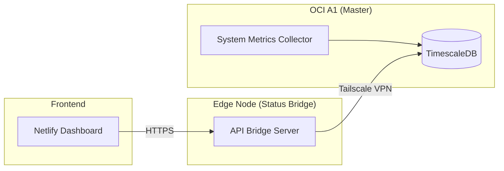

# Instance Monitoring (인스턴스 모니터링)

이 프로젝트는 OCI A1(Master) 인스턴스와 에지 노드(Status Bridge) 간의 통신/데이터 규격을 정의하고, 이를 통해 인프라 및 서비스 상태를 실시간으로 모니터링하는 전문 저장소입니다.

## 📌 아키텍처 개요

## 🚀 주요 기능

- **실시간 인프라 모니터링**: CPU, Memory, Disk 사용량 추적
- **서비스 상태 관리**: 컨테이너 기반 서비스의 Running/Stopped 상태 감시
- **보안 통신**: Tailscale VPN을 통한 DB 접속 및 API Key 기반 인증
- **시계열 데이터 최적화**: TimescaleDB를 활용한 효율적인 데이터 관리

## 📂 디렉터리 구조

- `docs/`: 프로젝트 설계, API 명세, DB 스키마 및 회의록
- `api-bridge/`: Node.js/Express 기반의 데이터 중계 API 서버
- `ai-rules/`: 프로젝트 운영 및 협업을 위한 AI 에이전트 규칙
- `.agent/`: 개발 환경 설정 및 자동화 워크플로우

## 🛠 구성 요소별 상세 내용

### 1. External Monitoring Spec
상세 인터페이스 규격은 [docs/external_monitoring_spec_v1.md](docs/external_monitoring_spec_v1.md)에서 확인할 수 있습니다.

### 2. Database Schema
모니터링 데이터 저장을 위한 스키마는 [docs/schema.sql](docs/schema.sql)에 정의되어 있습니다.

### 3. API Bridge
데이터 중계 서버의 상세 설정 및 실행 방법은 [api-bridge/README.md](api-bridge/README.md)를 참조하세요.

## ⚖️ 거버넌스 및 규칙

이 프로젝트는 **Document-First(문서 우선)** 원칙을 따르며, 모든 변경 사항은 명시적인 승인 절차를 거칩니다. 상세 규칙은 [.agent/rules/ai-rules.md](.agent/rules/ai-rules.md)를 참조하세요.

---

**최종 업데이트**: 2026-01-19  
**프로젝트 상태**: 개발 중 (v1.0.0 Stage: Initial Bridge Implementation)
