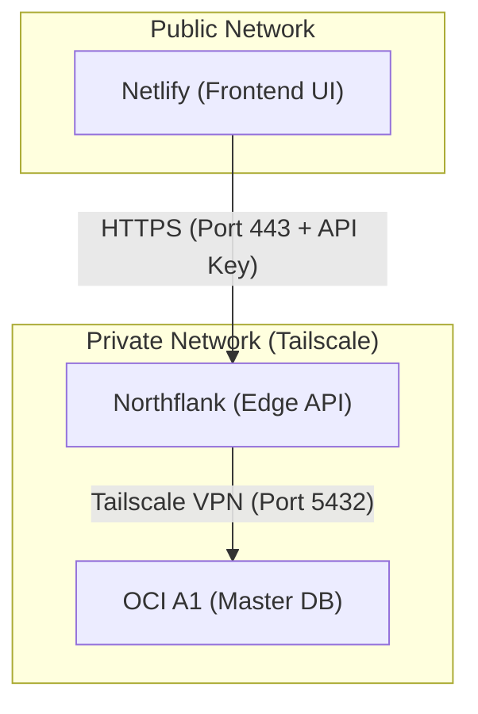

# Communication Environment Specification (v1.0)

이 문서는 모니터링 시스템의 핵심인 각 노드(OCI A1, 에지 노드, 프론트엔드) 간의 통신 방식과 보안 설정을 정의합니다.

## 1. 노드 간 연결 구조 (Topology)

## 2. 세부 통신 명세

### A. OCI A1 ↔ Status Bridge (DB Connectivity)
- **방식**: Tailscale VPN을 통한 사설망 통신.
- **인증**: DB MD5/Scram 패스워드.
- **필수 설정**:
  - `TAILSCALE_AUTH_KEY`: Northflank 컨테이너가 부팅 시 Tailscale 네트워크에 조인하기 위한 임시 또는 재사용 가능 키.
  - `DB_HOST`: A1의 Tailnet IP (`100.x.y.z`).

### B. Status Bridge ↔ Netlify (API Connectivity)
- **방식**: 퍼블릭 HTTPS API 요청.
- **인증**: 커스텀 헤더 `X-API-KEY`.
- **CORS 설정**:
  - `ALLOWED_ORIGIN`: `https://project-name.netlify.app` (Netlify 도메인 명시).
- **데이터 형식**: JSON (UTF-8).

## 3. 통신 환경 구축을 위한 Secrets 리스트 (GitHub)

| Secret Name | 대상 | 용도 |
| :--- | :--- | :--- |
| `TAILSCALE_AUTH_KEY` | Northflank | VPN 네트워크 접속용 |
| `DB_PASSWORD` | Northflank | PostgreSQL 접속용 |
| `X_API_KEY` | Northflank/Netlify | API 요청 인증용 |
| `API_BASE_URL` | Netlify | 프론트엔드에서 참조할 API 주소 |

## 4. 검증 시나리오 (Connectivity Test)
1. **Bridge → DB**: `nc -zv 100.x.y.z 5432` 명령으로 VPN을 통한 포트 오픈 확인.
2. **Frontend → Bridge**: `curl -H "X-API-KEY:..." https://.../api/status` 명령으로 외부 접속 및 인증 확인.
